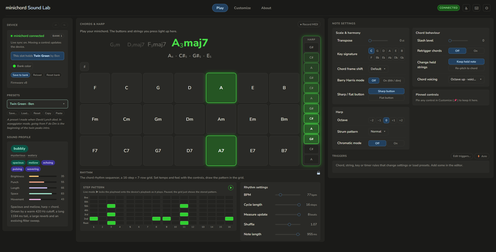

# minichord Sound Lab



A free companion app for the [minichord](https://minichord.com/). Watch your playing light up
live, learn what every setting does in plain language, and shape the instrument's sound. It runs
in your web browser, with or without a minichord plugged in.

## Try it now

**[Open Sound Lab in your browser →](https://minichorddrawn.github.io/minichord-soundlab/)**

Nothing to install. It opens like any web page. If you have a minichord, plug it into your
computer with a USB cable and click **Connect**.

## What it is

The minichord packs a full synthesizer into a pocket-sized instrument, but most of its settings
hide behind three knobs. Sound Lab lays them all out on screen, explains each one, and draws live
graphs of what you're shaping. Plug in over USB and you hear every change on the instrument as you
make it.

No minichord? Everything still works in **learning mode**. You can click around, read the
explanations, and even preview chords on the Play screen, all offline.

## Get your own copy

There are two ways to use Sound Lab.

### Use it online

Open the link above (once it's live) and you're ready. Bookmark the page if you'd like to come
back to it. It works on any modern computer.

### Download a copy that works offline

Sound Lab is one small, self-contained folder. You can keep a copy on your own computer and open
it any time, even with no internet.

If you've never used GitHub before, here's the whole process:

1. Open the project page: **https://github.com/MinichordDrawn/minichord-soundlab**
2. Click the green **Code** button near the top right.
3. Choose **Download ZIP**. A `.zip` file lands in your Downloads.
4. Unzip it (double-click on a Mac, or right-click and "Extract All" on Windows).
5. Open the unzipped folder and double-click **`index.html`**. It opens in your web browser.
6. Bookmark the tab so it's one click away next time.

That's the whole thing. No git, no command line, no setup. To connect a minichord, use **Chrome**
or **Edge**: they support the browser feature that talks to the device. Firefox works too, but it
asks for permission first. Safari can run the app in learning mode but can't connect the device.

## Using it with a minichord

1. Plug the minichord into your computer with a USB cable.
2. Click **Connect** in the Device card at the top left.
3. Play. The on-screen buttons and harp strings light up as you press and strum, and the chord
   you're holding is named for you.

Every control you move is sent to the instrument right away, so you hear edits as you drag. Use
**Save to bank** to store a sound on the device, and the **● Record MIDI** button above the Play
screen to capture what you play into a standard `.mid` file any music app can open.

## Using it without a minichord

You don't need the device to explore. In learning mode every control, graph and explanation works,
and the Play screen previews a chord when you click a button. It's a full tour of what the
instrument can do.

## How the live mirror works (and why it sometimes guesses)

Here's the part that surprises people. The minichord only sends the *notes* you play over USB, never
which button or string you touched. So Sound Lab works backwards: it knows your current settings,
works out the exact notes each button and string would make, and matches the incoming notes against
that to light the right ones.

Most of the time it's spot on. Now and then it has to make a best guess, because two different
chords can sound the same notes, or because a knob can change a setting without reporting it. When
it's unsure it picks the most likely reading and corrects itself as you keep playing. None of this
touches your sound. It only changes what lights up on screen.

## What you can do

- **Play** is a live mirror of the instrument. Chord buttons and harp strings light up as you play,
  the current chord is named for you, and the rhythm sequencer's playhead sweeps along in time.
- **Customize** opens every setting the firmware has, far more than the three knobs reach, grouped
  into sections (chord voice, harp voice, space, MIDI, knobs). Each one has a plain-language
  explanation and a live graph, and a built-in **Sound Profiler** describes any patch in words.
- **Presets** let you browse and load ready-made sounds, save your own, and copy settings to and
  from the clipboard to share.
- **Triggers** change a setting or load a preset automatically when you play a certain chord, pluck
  a string, or press a key.
- **Randomize** rolls a fresh sound with one click, with guardrails that keep it musical.
- **Pin** your favourite controls into the Play screen so they're always at hand.
- Click any **setting's name** or **underlined word** for a definition in plain English.

## Accessibility & comfort

Sound Lab is built to work for everyone, not just power users. From the ⚙ and ♿ buttons at the top
right you can set:

- **Text size**, from small to extra large.
- **Reduce motion**, to switch off animations and fades (or follow your system setting).
- **High contrast**, for stronger edges and brighter text.
- **Larger controls**, for bigger buttons, sliders and click targets.
- **Explanation depth**: Beginner spells everything out inline, Advanced keeps it tight.

The whole app is keyboard operable, with shortcuts you can customize (press **?** any time for the
list). It announces things like connecting and saving to screen readers, and a skip link jumps
straight to the main content. It runs offline, needs no account, and nothing you do ever leaves
your computer.

## Tips & troubleshooting

- **The device won't connect.** Use Chrome or Edge, and check that the minichord is plugged in with
  a USB *data* cable (some cables only carry power). Firefox shows a permission prompt first.
- **A steady buzz when it's plugged into a computer.** That's almost always a ground loop, not a
  fault. The About screen inside the app has a card explaining the easy fixes (a ground-loop
  isolator, headphones, or running on battery).
- **I moved a knob and nothing changed.** A few settings (the ones that change *which notes* the
  buttons and strings play) only take effect on the next chord press or strum. Play a note and it
  catches up.
- **The harp doesn't light up on the Play screen.** Turn off "single port mode" in the MIDI
  settings. The live mirror needs the harp and chords on separate ports.

## Free & private

Sound Lab is made by the minichord community, in the same spirit as the instrument. It's free and
always will be. It runs entirely in your browser, and nothing you play or edit ever leaves your
computer.

## The minichord

The minichord is an open-source instrument by Benjamin Poilvé. Sound Lab is an unofficial,
community-made companion for it.

- [minichord.com](https://minichord.com/), the project's home and documentation.
- [The user manual](https://minichord.com/user_manual/), how to play, charge and care for the
  instrument.
- [The community forum](https://minichord.discourse.group/), to share music, presets and questions.
- [github.com/BenjaminPoilve/minichord](https://github.com/BenjaminPoilve/minichord), the hardware
  and firmware sources.

---

## For developers

Sound Lab is plain HTML, CSS and JavaScript. There's no build step, no framework, and nothing to
ship beyond the folder itself. Open `index.html` and it runs.

### Project map

| File | Role |
|:--|:--|
| `index.html` | the page: three panels, script load order |
| `soundlab.js` | application glue: renders the UI from the catalog, owns patch state, wires everything |
| `params.js` | the parameter catalog: every sysex address with ranges, groupings and teaching copy |
| `devicemap.js` | the Play-tab mirror: forward-simulates firmware note math, infers buttons/strings from MIDI |
| `minichordcontroller.js` | Web MIDI transport: sysex dumps, parameter writes, bank commands |
| `graphs.js` | canvas visualizations per parameter group |
| `profiler.js` | rule-based "sound profiler": plain-language tags + feel-meters for any patch |
| `glossary.js` | inline audio-term definitions (click any underlined word) |
| `triggers.js` | the trigger engine: WHEN events run DO actions |
| `random.js` | the preset-weighted randomizer |
| `prefs.js` | persistent preferences (theme, density, accent…) in localStorage |
| `presets.js` | the shared preset bank + decoder |
| `MINICHORD-REFERENCE.md` | the technical reference: firmware note math, sysex protocol, and the inference engine spec |
| `__harness__/` | local regression testing for the inference engine (see its README) |
| `json/`, `fonts/` | preset data and the bundled typeface |

Everything Sound Lab knows about the firmware's behaviour is documented, with citations, in
[MINICHORD-REFERENCE.md](MINICHORD-REFERENCE.md).

### Testing & linting

The inference engine (`devicemap.js`) has a deterministic replay harness:

```sh
cd __harness__
node run.js > out.txt && diff out.txt golden.txt   # any diff is a behaviour change
```

See [`__harness__/README.md`](__harness__/README.md) for details. The rest of the app is verified
by hand in the browser. It's a UI.

Static checks guard correctness without imposing formatting. The dense data tables and aligned
comments are deliberate:

```sh
npm install        # dev tooling only; the app itself has no dependencies
npm run check      # everything below in one go
npm run lint       # eslint (JS correctness + per-token style)
npm run lint:css   # stylelint
npm run lint:html  # html-validate
npm run test       # devicemap harness vs golden transcript
npm run smoke      # headless Chrome boot test (needs Chrome installed)
```

## License

[CC BY-NC 4.0](LICENSE): free to use, share and adapt with attribution, but not commercially. The
same license family as the minichord hardware itself. Sound Lab is and will always be free.
